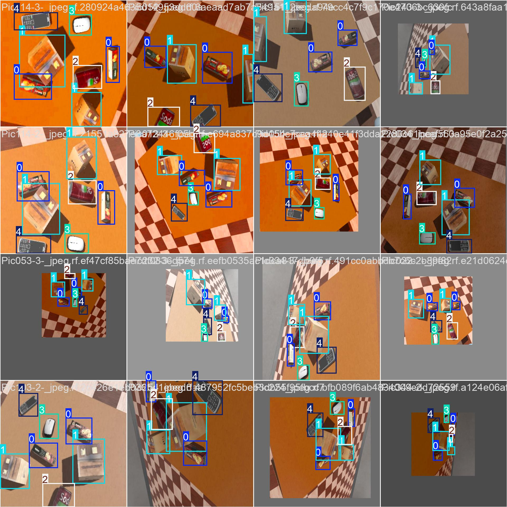
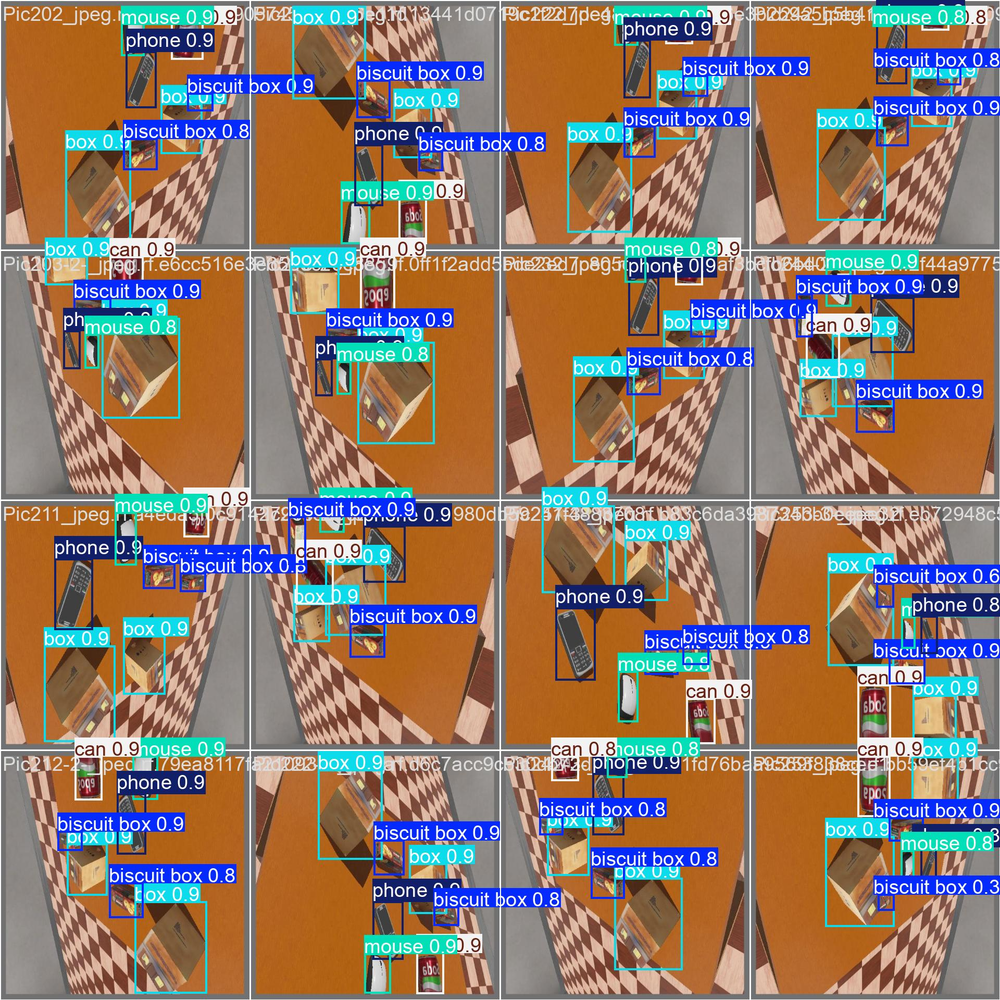
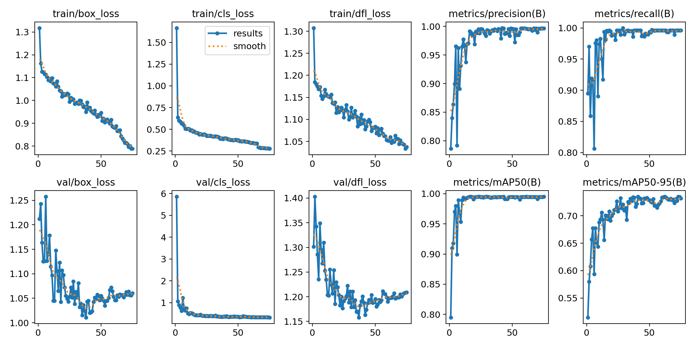
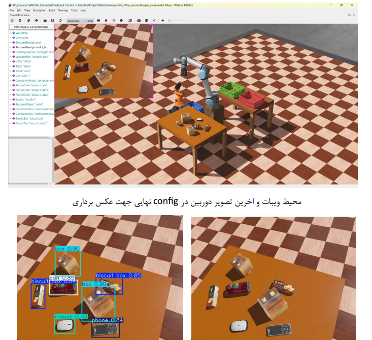
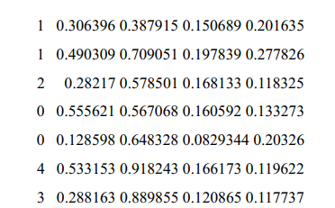

In this Project, the objects intended for us in the Webots environment are to be identified and identified through AI algorithms
Then, by grabbing those objects with a robotic arm, place them in Place the desired location. 
The objects you are going to encounter are: mouse, mobile phone, soda can, box
And the box of biscuits
   
  star if you like it ✨
   

Step 1 : Data Collecting 
In this part, the camera is placed on the robot automatically and take a picture with different angles from the table and objects on it.
   
   
   
   

  

Step 2 : Labeling and Training on YOLOv8

  
   
    
   
   
  
    
   
   
   
  

Step 3 : Pick and Place
After training, Robot can detect objects and give the coordination of objects 

  
   
  
   

